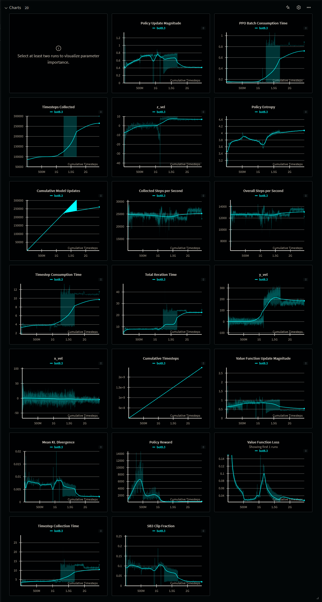
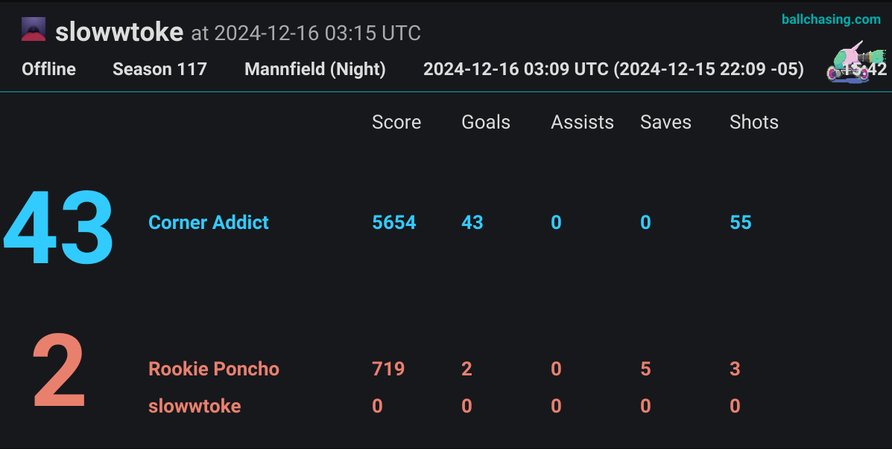
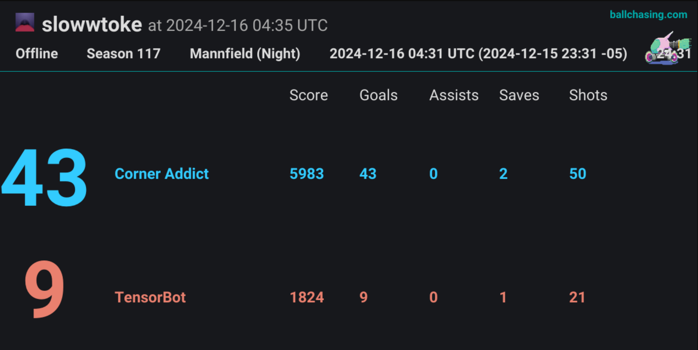
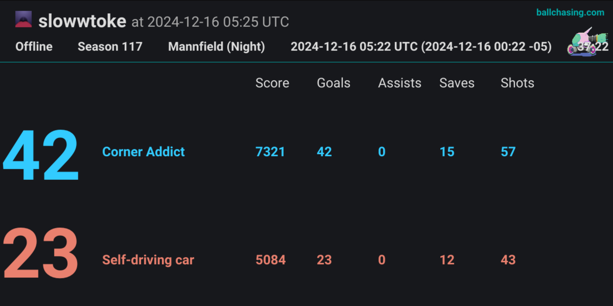

# Training a PPO-Based Rocket League Bot to Outperform Baseline AI Opponents
## MATT DION 
**G01286436**
## Table of Contents
1. [Introduction and Motivation](#introduction-and-motivation)
2. [Related Work](#related-work)
3. [Problem Definition and Data Collection](#problem-definition-and-data-collection)
4. [Theory, Metrics, and Background](#theory-metrics-and-background)
5. [Approach and Implementation Details](#approach-and-implementation-details)
6. [Experimental Setup](#experimental-setup)
7. [Results and Analysis](#results-and-analysis)
8. [Discussion and Future Work](#discussion-and-future-work)
9. [Conclusion](#conclusion)

## Introduction and Motivation
  The stock bots that are included in Rocket League are bad. Most players quickly outperform these bots after achieving a basic understanding of the controls and strategy.
  Rocket league is a relatively simple game with only a few different actions and a single goal of scoring more than the opponent, but has an infinitely high skill ceiling. 
  
  Reinforcement learning is the key to making better bots that can exceed human capabilities. Its potential for Team based Cooperative-Competitive breakthroughs is great. It has a very large state space and dynamic environment that makes hardcoding not feasible. Cooperative-Competitive MARL is still an open challenge in the robotics and ML field. 

  This tutorial is for those who want to train a bot using open source frameworks to be better then the stock Rocket League bots. This specific implementation is for 1v1, but 2v2 and 3v3 is supported.

  This tutorial will provide the resources necessary to make a bot using PPO, and beat all Psyonix bots, and the level 3 (of 5) community designated benchmark bots. Level 5 bots are better than most human players, and only getting better. They can even give pros hard times until the pro can exploit some weakness of the bot.

## Related Work
- **Existing Academic work**
  
  - _Level 5 community bot Nexto(pro level) uses Actor-Attention-Critic model to handle any team size_
  
    S. Iqbal and F. Sha, “Actor-Attention-Critic for Multi-Agent Reinforcement Learning,” in Proceedings of the 36th International Conference on Machine Learning, May 2019, pp. 2961–2970. Accessed: Jul. 12, 2022. [Online]. Available: https://proceedings.mlr.press/v97/iqbal19a.html

   - _A community favorite paper introducing a 2v2 MARL soccer environment with dense rewards we still use. They used vel_to_ball and vel_ball_to_goal._

      S. Liu, G. Lever, J. Merel, S. Tunyasuvunakool, N. Heess, and T. Graepel, “Emergent Coordination Through Competition.” arXiv, Feb. 21, 2019. Accessed: Jul. 12, 2022. [Online]. Available: http://arxiv.org/abs/1902.07151
  
  - R. Lowe, Y. Wu, A. Tamar, J. Harb, P. Abbeel, and I. Mordatch, “Multi-Agent Actor-Critic for Mixed Cooperative-Competitive Environments.” arXiv, Mar. 14, 2020. Accessed: Jul. 05, 2022. [Online]. Available: http://arxiv.org/abs/1706.02275

  - J. Schulman, F. Wolski, P. Dhariwal, A. Radford, and O. Klimov, “Proximal Policy Optimization Algorithms.” arXiv, Aug. 28, 2017. Accessed: Dec. 17, 2024 [Online]. Available: https://arxiv.org/abs/1707.06347

- **Open source code used**
  - https://github.com/RLGym -Rolv
  - https://github.com/Rolv-Arild/Necto -Rolv
  - https://github.com/redd-rl/apollo-bot -Redd
  - https://github.com/ZealanL/RLGym-PPO-Guide -Zealan
  - https://github.com/ZealanL/RLGym-PPO-RLBot-Example - Zealan
  - https://github.com/ZealanL/RocketSimVis - Zealan
  - https://github.com/ZealanL/RocketSim - Zealan

## Problem Definition and Data Collection
- **Original Goal**  
  Beat the Rookie(level 1) Psyonix bots in a 2v2 match with bots trained via Machine Learning.
    - **Intermediate Milestones** 
      - Touch the ball.
      - Score a goal.
      - Move well.
      - Train a 1v1 bot.

- **Revised Goal**
  Beat the level 3 bot self-driving-car with a PPO trained bot.
    - **Intermediate Milestones**
      - Train a 1v1 bot to this level
      - Train a 2v2 bot to this level
      - Learn aerials
      - Learn Dribbling
      - Consistently get ball in net on purpose.
      - Make saves
      - Play like a human

- **Environment and Datasets**  
  RLBot runs in Rocket League, and has training available, but we wont be using that.
  RLgym_sim simulates the rocket league environment and allows for many more instance to be run much faster than real life. The collision data and physics engine for Rocket League is extracted and used in the simulator, so the simulated environment is identical in its function. 

- **Data Collection Process**  
  Metrics are compiled in Weights and Biases (Wandb). This tracks things like policy reward, Mean_kl divergence etc.

## Theory, Metrics, and Background
- **PPO background**  
  PPO Was introduced by Schulman et al. in the 2017 paper "Proximal Policy Optimization Algorithms" It improved upon existing policy gradient methods by learning on multiple epochs of policy updates, and ended up being simpler while performing better.

- **Metric**  
  Being "better" than a bot is defined as the probability of scoring the next goal being greater than 50% with a 95% confidence level.
  Model the game as a binomial distribution, where each goal is regarded as an independent random trial.
  Number of trials (n=69) and p=0.5 (null hypothesis).
  Stopping rule: achieve 42 goals before the opponent scores 28 to reject the null hypothesis with p<0.05.

- **Why This Metric?**  
  This is how RLGym Discord Server Roles are assigned.

  "Special roles are offered to people whose ML bot beats the following bots (any gamemode, in RLBot):
  - Rookie (@Rookie Ruiner)
  - TensorBot (@TensorBot Trouncer)
  - Self-driving car (@Self-Driving Car Sabotager)
  - Element (@Element Eliminator)
  - Nexto (@Nexto Nullifier)
  
  In the spirit of science, winning is conditioned on statistical significance; the probability of your bot scoring the next goal should be larger than 50% with a 95% confidence interval. (see ⁠general⁠)
" - Rolv
  

## Approach and Implementation Details
- **Step-by-Step Instructions**  
  See [Setup](setup.md) to get everything installed and running.
  See [Learner](learner.md) for hyperparameter explanations and suggested values.
  See [rewards](rewards.md) for explanations of what a reward is, the ZeroSum wrapper, Curriculum learning with AnnealRewards, combining all rewards into one function, and my personal set of reward iteration that led to a Level 3 bot. 

- **Bots in Repo**  
  - Multiple iterations of bots are included, ultimately all bots prior to bot6 were failures.
  - Bot6 is my pride and joy who beat the level 3 bot.
  - the PPO_Policy.pt is included. This is the bots current brain.
  - bronze_scoring.py is the main file that in modified from example.py
  - Each bot has an increasing number of files taken from other open source repos.
  - The trained RLBot version is located in Corner_Addict. You can copy it into RLBot under ./MyBots

- **Modifications from Base Implementations**  
  - Many hyperparameters were experimented with, and change as learning goes on. The reward functions and their weights mentioned by Zealan in his guide only work for getting the Bot to push the ball around. He suggests ideas for new reward functions, but not the implementations. I wrote my own reward function TouchVelocityReward() that sought to make the bot hit the ball around instead of farming the touch reward by pushing the ball and maintaining contact. I pulled some reward functions from Apollo bot, some from the rlgym libraries. The getCheckpoint function is from Apollo, which was likely pulled from another bot, while the command line rendering function was mine. While the AnnealRewards() function was also pulled from Apollo, my method of making multiple combined reward functions and updating the current reward function throughout training was done myself.

  - Deciding which Reward functions to use, at what points, with which weights, to guide the bots behavior was entirely my own. The basic reward functions are well known, but their weights and usage vary significantly between bot makers.

## Experimental Setup
- **Training Procedure**  
  Bot6 "Corner_Addict" trained for 2 billion steps across 2 days. The reward sequence can be found in [rewards.md](rewards.md).

- **Opponent Setup**  
  The opponent bots are already included in RLBot. The match is a normal 1v1 Rocket League match with unlimited time.

## Results and Analysis
- **Quantitative Results**  
  Bot6(8.3) lifetime graphs
  

  # Match Results
    - # Rookie Ruiner
      
      https://ballchasing.com/social/replay/a1e06f48-17c6-401c-b9c6-562cb39eea13

      https://ballchasing.com/replay/a1e06f48-17c6-401c-b9c6-562cb39eea13

    - # Tensorbot Trouncer
      
      https://ballchasing.com/social/replay/2285b253-fef3-4b3f-823b-77e515bf67e3

      https://ballchasing.com/replay/2285b253-fef3-4b3f-823b-77e515bf67e3

    - # Self Driving Saboteur
      
      https://ballchasing.com/social/replay/9185fc1c-c080-432f-8c98-984bf6a09b37

      https://ballchasing.com/replay/9185fc1c-c080-432f-8c98-984bf6a09b37

- **Qualitative Observations**  
  See [rewards.md](rewards.md) for bot observations and reasoning for reward function adjustment.
  Videos of training are terrible quality due to making out system resources while training. But the desired behavior can be observed [here](https://www.youtube.com/watch?v=tNQwHXOGCTc).

- **Failure Cases**  
  The bot struggled with kickoffs against TensorBot and Self-driving-car. I never had any kickoff rewards, only relying on my already lowered SpeedToBallReward() by the time kickoffs were introduced. There was no sense of urgency as the bot goes for midboost instead of back to goal to defend. I am lucky the other bots generally did not capitalize on the ball being in front of my net.

  I was not able to get the 2v2 off the ground, the learning time was much longer and I decided to focus on 1v1 first. I eventually just ran out of time. Each iteration of the bot can take days as I try different things. 1v1 had more known good reward functions available. You can't really debug anything in this environment, so I could not tell when my custom reward functions were the culprit or if it was something else. Thats why I focused my efforts on being able to modify rewards without breaking my bot. Many a bot became braindead after an update that was too drastic.

## Discussion and Future Work 
- **Ideas for Future Improvements**  
  2v2 is my next challenge, along with better dribbles and aerials. 2v2 will need more custom reward functions like proper teammate spacing and rotation. What needs a function to guide it, and what should emerg naturally during training? We will have to see. 

  I will also be attempting more custom reward functions for the 1v1 bot, now that I know what works.

## Conclusion
  While I was unable to beat the rookie bots in a 2v2 match, I did beat 3 out of 5 of the community baseline bots. I did not attempt level 4 due to how close the level 3 results were. I did blow past many intermediate milestones. Getting the bot to push the ball around was the first suggested milestone, and that was achieved almost immediately, and instilled a false sense of confidence toward the rest of the challenge. My hand was held up until that point. Once things weren't so clearly laid out I certainly struggled for a long time, suffering brain death after brain death.  
  
  I did achieve all original intermediate milestones, touching the ball, scoring, moving well (fast and in right direction). An earlier bot, bot 4 had discovered wavedashes on its own. Of the revised goals, I was able to score consistently, shadow defend well, exhibit some behaviors that are better than human at a similar level like patience, dribble with the ball on the ground, make baby aerials. My only failure is not doing this in 2v2 as originally intended.

